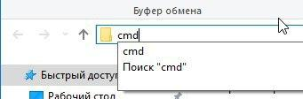

### Windows: Как в консоли перейти на другой диск?

Чтобы в консоли перейти в другой диск (например, на диск E), нужно ввести команду (набрать текст и нажать после этого клавишу <Enter>):

```cmd
cd /d e:\
```

или так:

```cmd
pushd e:
```

или (самое простое):

```cmd
e:
```

Также можно в пути проводника набрать cmd и консоль откроется сразу в нужной папке.
